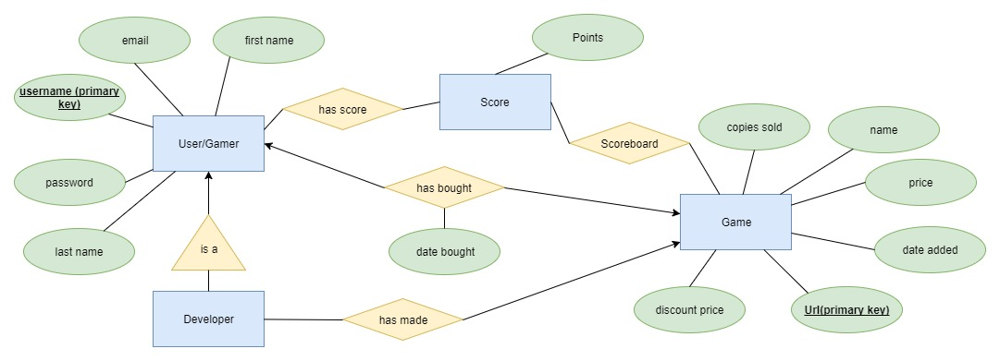

# WebShop - Project plan #
 
#### Participants: ###
* Lasse Liimatta - 592929 
* Elisa Naskali - 593371 
* Sofia Kimpimäki - 586883 
 

## Main goals and vision of the project ##

**Project vision:** In this project, we will build a simple web shop for selling and playing JavaScript games. End result should be done in a way that we can be proud to present it.

**Individual goals:** We are trying to make the best out of the project, but also learn along the way. And although the end result matters to us, we place more value on the learning process itself. 

 
## Plans for the project ##

 
### Features we plan to implement and how ###
 
**Authentication:** We are going to use Django auth. We will make a database of every user, and Django auth’s job is to work in the backend and check whether the login request is valid using the database.
 
**Basic player functionalities:** Games can be searched with any attribute that they have, such as name or developer.
When player buys a game, we will create new instance of existing hasBought-relation that connects player to the bought game. hasBough has 2 attributes - buyer(users primary key) and url(games primary key). Idea is that when then user ask to play game, in other words the user wants to open a certain view(url), the backend checks whether that person is connected to the the games url in the hasBought attribute.
 
**Basic developer functionalities:** When user has logged in, they can add games from their profile page. When adding a game, a new instance of Game relation is created when the user has given the needed attributes. Developers will also be able to see stats of their games in their profile page. Developers will also be able to see statistics of their game’s in the profile page when they open a view for certain game.
 
**Game/service interaction:** When player buys a game, we will increment games “copies sold” -attribute by one. JSON- data is used in order to render certain messages to the client side.
 
**Quality of work:** Our main focus is on having smaller amount of well implemented features rather than trying to have everything. We strive to have good, high quality code. What comes to UX-design, the usability of the product has more weight when making decisions rather than trying to focus on the visual design. Our decisions related to UX are also made by asking feedback from peer attendees of the course.
 
 
**Own game:** We will probably do some kind of simple Pong-game in JavaScript. The game has high score, save and load features. And if possible, a duel between 2 persons.
 
**Mobile Friendly:** Bootstrap has its own grid system that makes it possible for us to make the website responsive.

### Views of the project ###
 
**Views:** Our product consist of several different views and components:
 
* Front page. Just like every other page, we have a front page. For our project, it’s not the most necessary part. It’s just used to display some messages, info, etc.
* Sales page. In this view we have list of all the games that are currently available for sale. Also, some features will be implemented, like a search bar for example.-->
* Game view. When a game is selected in the sales page, a view should be opened, or a section expanded for the details of the game to be displayed. In this section you will also be able to purchase the game and see any statistics related to it
* Profile page. In this view the user is able to change settings, and so on. Developers have extended view in this section so that they are able to manage their games and see the related data.
* Login/register prompt. Opens up from the navigation bar and lets the user to sign in, or new user to register.
* Navigation bar. Lets the user to navigate through the web page or login/register
* Error page. If something goes wrong or something weird happens, this page will be displayed.

### Example models ###

* **User**
	* username STRING, Primary key
	* email EMAIL
	* first name STRING
	* last name STRING
	* password STRING
 

* **Developer** inherits from User
	* username STRING, Primary key (Inherited from User)

* **Game**
    * copies sold INT
    * name STRING
    * price DOUBLE
    * date added DATE
    * url PRIMARY KEY
    * discount price DOUBLE
 

* **Score**
    * points INT
    * game FOREIGN KEY
    * username FOREIGN KEY
 

* **hasBought**
    * date bought DATE
    * game FOREIGN KEY
    * username FOREIGN KEY
 

* **hasMade**
    * username FOREIGN
    * game FOREIGN KEY	

 
 
### Priorities ###
 
**Higher priorities:** Main priority for each of us to learn how to make a fully functional website. And what comes to the project itself, we aim to have a site which is actually usable and nicely working. In our vision a successful product does not rely on the amount of the features, but the quality of them instead.
 
**Lower priorities:** We don’t find that visual design is the main focus in this project. In real case it would be done with professionals that have experience in visualization.

### Working practices and schedule ###
 
 
**Meetings:** We aim to have predefined meetings at least once a week so we can work, and plan things forward. That way we can have steady progress every week and there shouldn’t be too much of a need for dashes that increment the workload for short periods of time.
 
**Communication and project management:** Our direct communication happens via Telegram. Also, we plan to use Trello organizing and distributing tasks are easier. Gitlab is used for version control.
Our aim is to progress every week, and have a steady workflow.

 
#### Schedule ####
 
* Week 1: We start our project. Models are the most important thing to get ready. After that the plan is start doing with front page. Style of the page is not yet so important. Working platform is our plan to week one

* Week 2: We are working on with the front page still and when it’s done login/register prompt is the next priority and profile page.
 
* Week 3:  Login/register prompt will be ready and it is possible now login. When user has logged in (s)he can add the JavaScript game and the game will have only price. The game can be on the sale.
 
* Week 4: Game view. See details of the game and the place where user can find games. Some games can be on the sale.
 
* Week 5: How to buy a game. And when the game is bought, how to play game. The user can see the games (s)he has bought. And only those games user can game. If there is game, user haven’t bought and (s)he try to play it, there will be some comment like you have to buy game to play.
 
* Week 6: High score. All the games have high scores. When you have played some game if your score is the new high score, the high score will change. At the same time we start doing our own game.
 
* Week 7: Navigation bar and error page.

### Testing ###

**Testing:** We will test our project as much as possible every week. It is not marked in the weekly schedule because it belongs to all the things we will do. We will have separate unit tests using django’s built in unittest- module. We will also test our web shop ourselves and ask our friends to review it. 

### Report ###

We immplemented all the required features.   
  
**Authentication**: User can register as either a developer or a regular gamer. E-mail- verfication s required for completing the registration process. In case user forgets
his or her password, they can reset it via email also. Both e-mails works on console. User can log in and out.   
We think this deserves full 200 ponts because we implemented everything that was required and verification methods.

**Basic player functionalities**: Users can buy games that they don't already own or have developed. User can only buy each game once. Users can play games that they have bought or developed.
If person who isn't logged in tries to play games they are redirected to log in. f player who hasn't bought the game tries to play it, they will be redirected to buyng screen.  
For this we deserve 300 points.

**Game/service interaction**:  
Users can submit their high scores and best 10 get displayed under the game.  
We think we deserve 150 points for this.

**Quality of work**: We tried making the service as intuitive to use as possible. We also added possibility to add pctures to both users and games, and own profile pages. On the code side we commented a lot of harder to understand code and extended base_html in a way that
didn't force us to copy same html everywhere. We also tried slicing our project to smaller apps n a way that made sense to us. We tried to do most of the logic-work in views instead
of templates.   
We believe we deserve 100 points for this.

**Non-functional requrements**:
We made a good project plan.  
We divided our tasks, and have oftern worked together and helped each other to solve problems while implementng them.   
We deserve 200 points for this.

### Who did and what now ###

Lasse: 
* Lots of heroku problem solving
* game list- views and game views
* game-id-generator
* highscores and other game service interaction

Elisa: 
* Authentication and all the user- related things
* payment and buying games
* CSS
* adding pictures for users and games
* lots of other small stuff around the block

Sofia:
* Developer functionalities
* adding games and updating game info
* bought game statistics
* some CSS
* game-id-generator 

### Heroku ###

Linkki: https://evening-stream-68210.herokuapp.com/

**Example users**:  
  
Developer:  
    username: DevaaJane  
    password: salasana  
    
Gamer:  
    username: GamerKalle  
    password: salasana